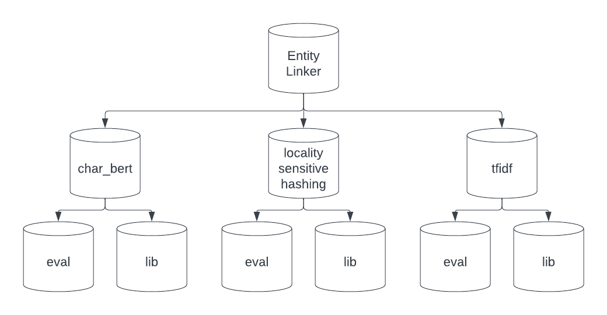

# EntityLinker

Curation of methods and programs to link records with an emphasis on names and addresses.
To use library:
```
git clone https://github.com/jdm365/EntityLinker.git
cd EntityLinker
make
```

To use with environment.yml:
```
git clone https://github.com/jdm365/EntityLinker.git
cd EntityLinker
conda env create -f environment.yml
conda activate EntityLinkerEnv
make
```



Each of the three categories of methods have various utility functions located 
in the `lib` packages. Main utility functions common to all libs are the `dedup`
functions. Some of the libs also offer similarity search functions, but often times
the recommended approach is to simply use the underlying libs alone 
(i.e. faiss, datasketch lsh, pynndescent, etc.)

Evaluation of each of the methods against a test dataset of companies can be seen
in the eval directories. This will run the dedup/sim_search algorithm against corrupted
data (corrupted by `utils/fuzzify.py`) and report the recall scores @5. None of the methods
here showed nearly good enough standalone performance (for deduplication) to be used alone
so we avoided using precision as a metric and rather view these algorithms as 
"candidate generation methods". Therefore a high recall and reasonable runtime are very
valuable but excellent precision is not as important.

To run evaluation on all of the modules run the `eval/main.py` file.


To test modules run `pytest`.


We offer three methods in this repo chiefly supported by the libraries datasketch (for lsh),
sklearn (for tfidf and kd_tree knn), HuggingFace (for the char_bert, mainly Byt5, model), 
and faiss (for rapid similarity search).


<h3>Methods Overview</h3>
Method 1: Locality Sensitive Hashing
Locality sentive hashing is done by hashing shingles of a string with N different
hashing functions. The shingles are then hashed into buckets. The buckets are then
compared to find the most similar strings using the jaccard similarity metric.


Method 2: TFIDF Nearest Neighbor Search
TFIDF vectorizes text by getting the counts of each token which occured
in a document, representing this as a `vocab_size` dimensional vector.
The TFIDF vector is then normalized by the number of tokens in the document.


Method 3: Pretrained Charachter Level LLM Embedding Nearest Neighbor Search
Byt5 is a pretrained language model from Google which uses a charachter level tokenizer.
The model is part of the T5 family of models. 


<h3>Primary Function APIs:</h3>

<h5>LSH</h5>

```
dedupe_lsh(items, threshold=0.6, num_perm=128)
```

Deduplicate items using datasketch's LSH methods. \
items     - list or array of strings to deduplicate \
threshold - minimum jaccard similarity to consider \
num_perm  - Number of hashing functions to use in LSH (higher is more accurate at the cost of compute time)


<h5>TFIDF</h5>

```
dedupe_knn(items, k=5)
dedupe_approx_knn(items, k=5)
dedupe_faiss(items, k=5)
```

**In order:
Deduplicate items using sklearn kd_tree knn. \
Deduplicate items using pynndescent approx knn. \
Deduplicate items using efficient faiss index (autoselected based on data size). \
items     - list or array of strings to deduplicate \
k         - number of candidates to return per item (num nearest neighbors)


<h5>BYT5</h5>

```
HuggingFaceByt5Wrapper()
    forward(X: str)
    get_embedding(X: str)

dedupe_byt5(items, model, k=5)
```

Use Byt5 LLM from HuggingFace to deduplicate the dataset. \
items     - list or array of strings to deduplicate \
model     - NN model which takes string as input and outputs vector embeddings \
k         - number of candidates to return per item (num nearest neighbors)


<h3>Utility Functions:</h3>

```
create_faiss_index(embeddings)
```

Creates an efficient faiss index dependent on the data size. \
embeddings - List/Array of nd.array vector embeddings.

```
create_dedup_df(idxs, distances)
```

Utility function to create deduplicated pd.DataFrame from knn indices and distances. \
(Useful for a variety of sim search libraries)

idxs      - for items 0..N, idxs is a (k, N) array of idxs representing the nearest neighbors in the original dataset. \
distances - distances (by any measure) correspoding to item i and idx[j, i].

```
compress_vectors(vectors, n_singular_values=None)
```

Use scipy's sparse SVD to compress a dataset of sparse vectors to dim=n_singular values while approximately preserving inner products. \
If n_singular_values is None then the minimum of the square root of the dimension and 256 will be chosen.

vectors           - List/Array/Matrix of sparse vectors to compress. \
n_singular_values - number of singular values to use in SVD. Dimensionality of resultant vectors.


